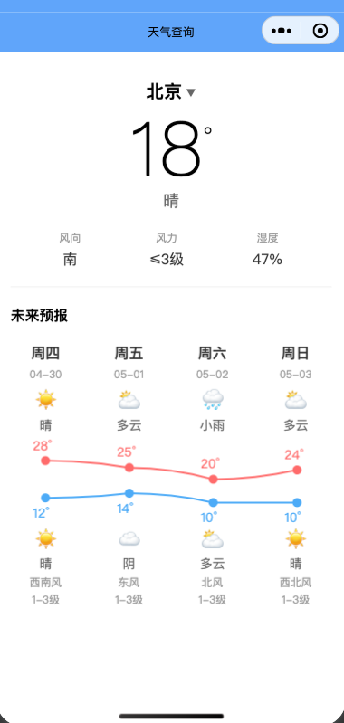
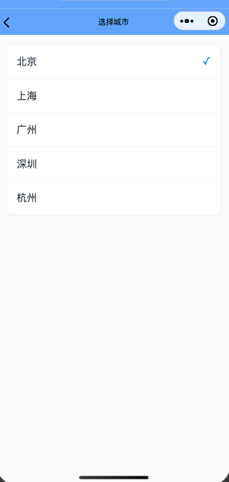

# Weather Mini - 天气预报小程序

一款基于 uni-app + Vue 3 + TypeScript 开发的天气预报小程序，调用高德地图天气 API 获取实时天气和未来预报数据。

## 功能特性

- **实时天气**：显示当前城市、温度、天气现象、风向、风力、湿度
- **未来预报**：5 天天气预报，支持横向滑动浏览
- **城市切换**：支持选择不同城市，数据本地缓存
- **折线图**：Canvas 绘制温度趋势图，红色代表白天温度，蓝色代表晚上温度
- **精美 UI**：简洁的卡片式设计，仿 iOS 天气 App 风格

## 技术栈

- **框架**：uni-app + Vue 3 + TypeScript
- **样式**：CSS（scoped）
- **图表**：Canvas 2D
- **缓存**：uni.setStorage / uni.getStorage
- **接口**：高德地图天气 API

## 项目结构

```
weather-mini/
├── src/
│   ├── apis/
│   │   └── weather.ts          # 天气 API 调用
│   ├── data/
│   │   └── cities.ts           # 城市列表数据
│   ├── pages/
│   │   ├── index/
│   │   │   └── index.vue       # 首页（天气展示）
│   │   └── city/
│   │       └── city.vue        # 城市选择页
│   ├── types/
│   │   └── weather.ts          # TypeScript 类型定义
│   ├── utils/
│   │   ├── request.ts          # 网络请求封装
│   │   └── storage.ts          # 本地存储封装
│   ├── App.vue
│   ├── main.ts
│   ├── manifest.json
│   ├── pages.json
│   └── uni.scss
├── package.json
├── README.md
└── forecast-section-code.md    # 未来预报板块代码文档
```

## 核心文件说明

### 页面文件

| 文件 | 说明 |
|------|------|
| `pages/index/index.vue` | 首页，展示实时天气和 5 天预报 |
| `pages/city/city.vue` | 城市选择页，支持切换城市 |

### 工具文件

| 文件 | 说明 |
|------|------|
| `apis/weather.ts` | 封装高德天气 API 的 `getLiveWeather` 和 `getForecast` 方法 |
| `utils/request.ts` | 基于 `uni.request` 的网络请求封装 |
| `utils/storage.ts` | 基于 `uni.setStorage` / `uni.getStorage` 的本地缓存封装 |
| `types/weather.ts` | 天气相关数据的 TypeScript 类型定义 |

### 样式文件

| 文件 | 说明 |
|------|------|
| `uni.scss` | uni-app 全局样式变量 |
| `forecast-section-code.md` | 未来预报板块的代码汇总文档 |

## 界面预览

<!-- 预留截图区域 -->

<!-- 请在此处截图您的运行界面 -->

<!-- 1. 首页天气界面 -->


<!-- 2. 城市选择界面 -->  



## API 配置

本项目使用高德地图天气 API，需要配置有效的 API Key：

```typescript
// src/apis/weather.ts
const AMAP_KEY = "your_api_key_here";
```

获取高德 API Key：https://console.amap.com/dev/key/app

## 运行项目

```bash
# 安装依赖
npm install

# 运行微信小程序
npm run dev:mp-weixin

# 编译微信小程序
npm run build:mp-weixin
```

## 许可

MIT License